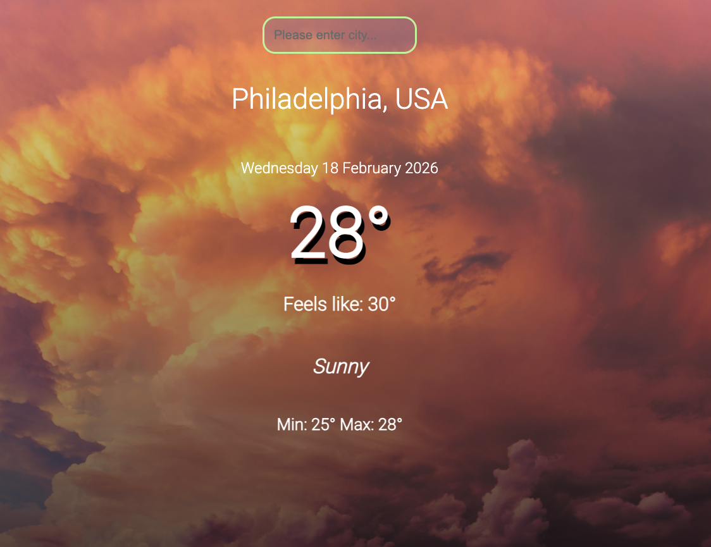

# 🌦️ Weather Forecast App

A sleek and responsive weather application built with vanilla **JavaScript** and **OpenWeatherMap API**. This app provides real-time weather data and dynamically changes its theme based on current conditions.

---

## 📸 Preview



👉 <a href="https://bestrecipesearch.netlify.app/" target="_blank">
  
</a>

## ✨ Features
* **Live Search**: Get weather updates for any city worldwide by pressing "Enter".
* **Auto-Load**: Automatically displays weather for a default city (Kyiv) on startup.
* **Dynamic Themes**: The background changes dynamically based on weather conditions (Clear, Clouds, Rain, Snow).
* **Detailed Info**: Displays temperature, "feels like" stats, daily min/max, and the current date.

## 🛠️ Technologies Used
* **HTML5** & **CSS3** — For structure and styling.
* **JavaScript (ES6+)** — For API integration and DOM manipulation.
* **OpenWeather API** — Reliable source for real-time weather data.

## 🚀 Installation & Run

### 1. Clone the repository
```bash
git clone https://github.com/NataliiaLitskevych/Weather.git
```

### 2. API Key Setup
* **Placement**: Ensure your API key is correctly placed in the `script.js` file inside the `api` object.
* **Activation**: Note that new OpenWeatherMap keys may take up to **2 hours** to activate. If you get a 401 error, please wait and try again later.

### 3. Launching the App
* **Local Run**: Simply open `index.html` in your favorite web browser to start the application.

---

## 📂 Project Structure

* **index.html** — The main entry point of the application.
* **style.css** — Contains custom styles and dynamic gradient backgrounds.
* **script.js** — Contains all the logic for fetching and displaying weather data.

---
Developed by Nataliia Litskevych
